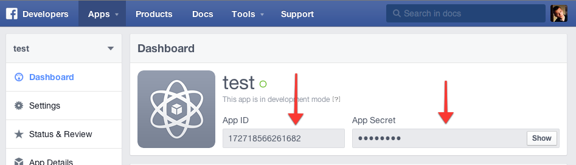
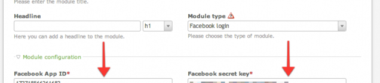

# Facebook Login – Documentation

## Setup Facebook app

First of all, you need to create the Facebook app. Not page, not group, but an app. Once it is created and configured, 
copy the `App ID` and the `App Secret` key. They are needed to setup the front end module in Contao.

The app should have the following permissions: email, public_profile.

## Front end module

Now, go to Contao and create a front end module called `Facebook login`. Enter the Facebook credentials you have just copied. 
Configure the other settings of the module like member groups.

## How does it work?

When the user tries to login with the Facebook account, the script looks for a member that has particular Facebook ID 
stored in the database. If none is found, then a new Contao member is created based on settings set in the front end module. 
When the account exists, user is logged in as a regular Contao member.
